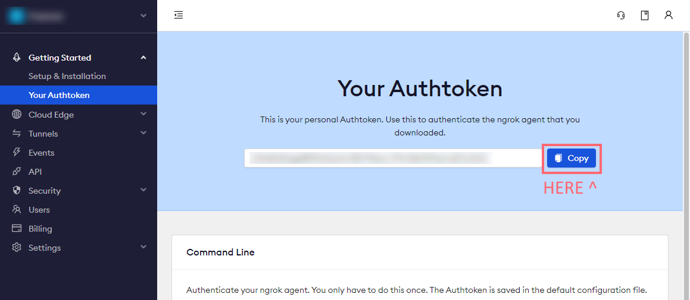
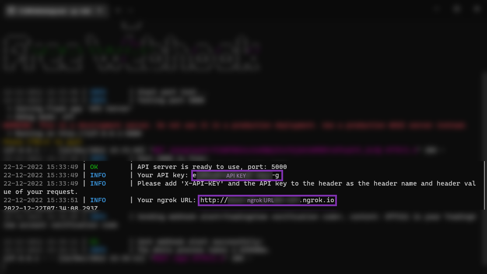
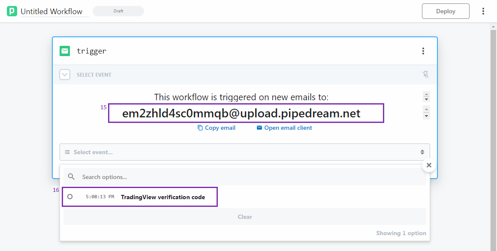
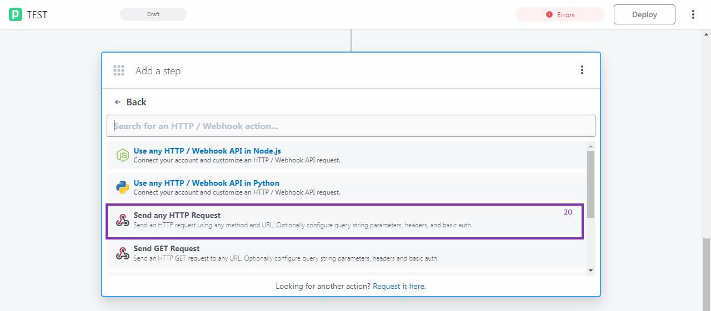
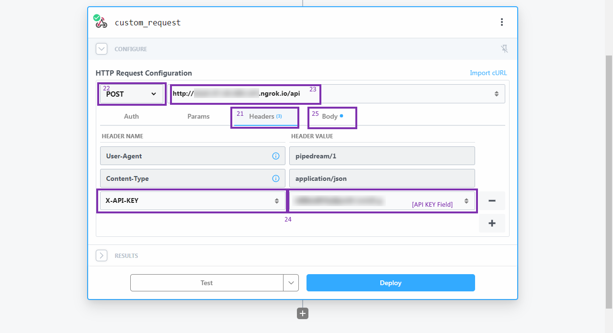
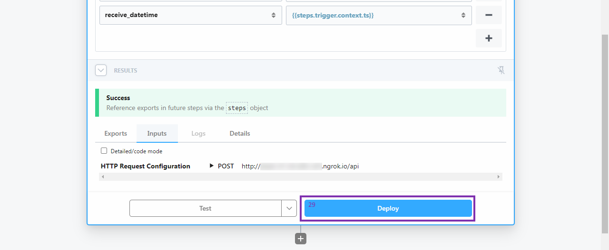

# Getting Started with TradingView-Free-Webhook-Alerts

## ⚙️ Installation
- [Installing Python package](#installing-python-package)
- [ngrok Version](#ngrok-version) (recommended)
    - [Extra Requirement](#ngrok-version-extra-requirement)
    - [Setup](ngrok-version-setup)
        - [Configuration](#ngrok-version-configuration)
        - [Find API KEY and ngrok URL](#ngrok-version-find-api-key-and-ngrok-url)
        - [Setting up pipedream](#ngrok-version-setting-up-pipedream)
- [Traditional Version](#traditional-version)
    - [Extra Requirement](#traditional-version-extra-requirement)
    - [Setting up configuration](#setting-up-configuration)
    - [Setting up email configuration](#setting-up-email-configuration)
        - [Gmail](#setting-up-gmail-configuration)
        - [Outlook/Hotmail](#setting-up-ms-email-configuration)
        - [Other](#setting-up-other-email-configuration)

## 🌻 Usage
- [Setting up TradingView alert](#setting-up-tradingview-alert)
- [Program Deployment](#program-deployment)

## 1. Installing the Python package dependencies

To install the Python package dependencies you have to type `pip install -r requirements.txt` into the command prompt which already cd into the project directory.

## 2. ngrok Version

### 2.1 Extra Requirement
* A [ngrok](https://ngrok.com/) account.
* A [pipedream](https://pipedream.com/) account or any other workflow 
automation service.

### 2.2 Setup

#### Configuration
1. Make a copy of the [`config.example.toml`](config.example.toml).
2. Rename the copied file to `config.toml`.
3. Open `config.toml` with any text editor you like.
4. Set `mode_traditional` to `false`.
5. Copy your ngrok authtoken and fill in `ngrok_auth_token`.

6. Fill in `webhook_urls` with your webhook service URLs.

> 🐳Tips: It is a good idea to test your signal or the program using a webhook test service such as [webhook.site](https://webhook.site/) instead of using your production webhook.
7. Save the config file.

#### Find API KEY and ngrok URL
8. Open the command prompt and cd into the project directory.
9. Type `pip install -r requirements.txt` to install the Python package dependencies.
10. Type `python main.py` to start the program.
11. Copy the "API KEY" and "ngrok URL" from the command prompt and paste them somewhere for later use.

12. Keep the program running in the background.
> ⚠️ Every time you start the program, you will get a new API KEY and ngrok URL. You need to update the webhook service with the new API KEY and ngrok URL.

#### Setting up [pipedream](https://pipedream.com/)
13. Login to [pipedream](https://pipedream.com/) and create a new workflow.

14. Select `New Emails` as the trigger.

15. Copy the email address given by pipedream and paste it into the `Email-to-SMS` field in your TradingView account. (You can follow this [instruction](https://www.tradingview.com/support/solutions/43000474398-how-to-change-the-email-to-sms-address-used-for-alert-notifications/) to change the `Email-to-SMS` email address.)
16. In order to find out the `Email-to-SMS` update verification code, you need to click the event dropdown menu below the given email address and select the verification email.

17. Find your verification code under `steps.trigger -> event -> body -> text` and paste it back into the `Email-to-SMS` field.
18. Click the "Continue" button.

19. Select `HTTP / Webhook`.

20. Select `Send any HTTP Request`.

 
22. Change the HTTP request method to `POST`.
23. Paste the ngrok URL into the "URL" field and add `/api` to the end of the URL.
> EG. https://12345678.ngrok.io/api
24. Add a new header field with the name `X-API-KEY` and paste the API KEY into the value field.
25. Go to the "Body" tab.

26. Change the "Content Type" to `application/json`.
27. Copy and paste the following KEY and VALUE pairs.

| KEY | VALUE |
| --- | --- |
| `from` | `{{steps.trigger.event.headers.from.value[0].address}}` |
| `subject` | `{{steps.trigger.event.headers.subject}}` |
| `content` | `{{steps.trigger.event.body.text}}` |
| `receive_datetime` | `{{{steps.trigger.context.ts}}` |

(order is not important)

28. Click the "Test" button.

29. If you see the message "Success", you can click the "Deploy" button.

30. You are done! Now you can test your TradingView alert.

## 3. Traditional version

### 3.1 Extra Requirement
* An IMAP available email account (eg.Hotmail, Outlook, Gmail, etc.)
  * Hotmail & Gmail have be tested and works well.

### 3.2 Setting up configuration

You must finish the following steps before using the program.

1. Make a copy of the [`config.example.toml`](config.example.toml).
2. Rename the copied file to `config.toml`.
3. Open `config.toml` with any text editor you like.
4. Fill in `email_address` and `login_password` with your email and password.
5. Fill in `imap_server_address` and `imap_server_port` with your email server and port. (For example, if you are using Hotmail, it will be `outlook.office365.com` and `993`, Gmail will be `imap.gmail.com` and `993`.)
6. Fill in `webhook_urls` with your webhook service URLs.
7. Save the config file.

You can adjust other settings on your own.

> 🐳Tips: It is a good idea to test your signal or the program using a webhook test service such as [webhook.site](https://webhook.site/) instead of using your production webhook.

### 3.3 Setting up email configuration

You must finish the following steps before using the program.

##### < Gmail >
1. Enable `2-Step Verification` on your Gmail account.
2. Create an **App Password** for the program to use. (Please read through this [article](https://support.google.com/accounts/answer/185833) for more information.) It is recommended to choose `Other (Custom name)` as the app in order to make it easier to identify in the future.
3. Fill in `email_address` and `login_password` with your email and the app  password.
4. Enable **IMAP** in your email account. (Please read through this [article](https://support.google.com/mail/answer/7126229) for more information.)

##### < OutLook/Hotmail >
You are good to go!

##### < Other >
1. Enable IMAP in your email account.

## 4. Setting up TradingView alert

1. Create a new alert as usual. (Fill in the `Condition`, `Options` and `Expiration time` fields.)
2. Enable `Send email-to-SMS` / `Send email` and other action you want in `Alert actions`. If you want another email address that is different from your TradingView account, you should enable `Send email-to-SMS` instead of `Send email`.
3. Fill in the `Alert name` and your webhook message in `Message`.
4. Save the alert.

## 5. Program Deployment

1. Open the command prompt and cd into the project directory.
2. Run `python main.py` in the command prompt.
> ⚠️ If you are using ngrok version, you will get a new API KEY and ngrok URL every time you start the program. You need to update the webhook service with the new API KEY and ngrok URL.